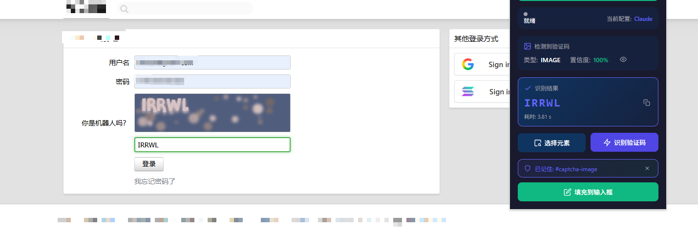

# AI Captcha Solver - Chrome扩展

一个功能完整的Chrome扩展程序，使用AI大模型自动识别和填充验证码。


[](说明)

## ✨ 功能特性

- 🤖 **多AI模型支持**：支持OpenAI、Claude、Google Gemini等
- 🔧 **可扩展API配置**：支持自定义API地址，兼容多种API格式
- 🎯 **智能验证码检测**：自动识别img/canvas/svg类型的验证码
- 🖱️ **手动选择模式**：类似DevTools的元素拾取器，支持手动选择验证码
- 💾 **记住网站规则**：自动保存网站验证码位置，下次访问自动应用
- ✍️ **自动填充**：识别后自动填充到输入框，模拟真实用户输入
- 📊 **统计分析**：记录识别历史和成功率统计
- 🔒 **安全存储**：使用Web Crypto API加密存储API密钥

## 📁 项目结构

```
auto_captcha/
├── manifest.json              # 扩展清单文件 (Manifest V3)
├── _locales/                  # 国际化
├── icons/                     # 扩展图标 (PNG)
├── src/
│   ├── background/           # Service Worker
│   ├── content/              # 内容脚本
│   ├── popup/                # 弹出窗口
│   ├── options/              # 设置页面
│   ├── api/                  # AI API适配层
│   └── utils/                # 工具函数
└── styles/                   # 样式文件
```

## 🚀 安装使用

1. git clone 此项目
2. 打开Chrome浏览器，访问 `chrome://extensions/`
3. 开启右上角的「开发者模式」
4. 点击「加载已解压的扩展程序」
5. 选择 `auto_captcha` 文件夹

## ⚙️ 配置API

1. 点击扩展图标，然后点击设置按钮
2. 在「API配置」页面，选择预设模板或添加自定义配置
3. 填入API地址和密钥，点击「测试连接」验证
4. 保存配置

### 配置示例

| 服务 | API地址 | 模型 |
|------|---------|------|
| OpenAI | `https://api.openai.com/v1` | gpt-4o |
| Claude | `https://api.anthropic.com` | claude-3-5-sonnet-20241022 |
| Gemini | `https://generativelanguage.googleapis.com/v1beta` | gemini-1.5-flash |
| 自定义 | 您的API地址 | 对应模型名称 |

## 💡 使用方法

1. **自动扫描**：点击「扫描」自动检测页面验证码
2. **手动选择**：点击「选择」启动元素拾取器，点击页面上的验证码元素
3. **识别**：点击「识别」调用AI识别验证码
4. **填充**：识别成功后点击「填充到输入框」

> 💡 手动选择的验证码位置会**自动保存**，下次访问同一网站时自动应用

## 🔐 安全说明

- API密钥使用AES-GCM算法加密存储
- 扩展仅在用户点击时运行，不会自动扫描
- 所有API请求均在本地发起

## 🐛 已知限制

- 跨域图片可能无法捕获（需网站允许CORS）
- 滑动验证码、点选验证码暂不支持

## 📄 许可证

MIT License

